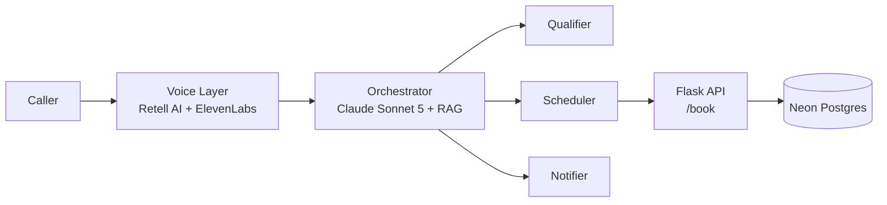

# AI Voice Agent for Missed-Call Recovery

A production voice AI system that answers missed and after-hours calls for home service
businesses (HVAC, plumbing, electrical, roofing), qualifies the job, books it, and
persists the booking — end to end, with no human in the loop unless the business wants
one.

Built solo, nights and weekends, from initial LLM experimentation through a working
multi-agent production system with real telephony, retrieval, tool use, and billing.

---

## What it does

A caller reaches this instead of voicemail. The agent has a real conversation, figures
out what the job needs (type, urgency, whether it's a true emergency), collects the
caller's name and service address, books the job through a live API call, and confirms
verbally — including safety guidance for genuine emergencies (e.g. shutting off water or
gas before help arrives).

## Architecture



- **Voice layer:** Retell AI handles real-time telephony and turn-taking; ElevenLabs
  provides the voice. In-call reasoning runs on Claude Sonnet 5 — chosen over Opus
  specifically because voice is latency-sensitive, and Sonnet is more than sufficient
  for this bounded a qualification task.
- **Grounding (RAG):** Business-specific facts (service area, hours, pricing) are
  embedded with Voyage AI and retrieved from a Chroma vector database, so the agent
  answers from real, current policy rather than a static prompt.
- **Tool access:** A custom MCP server (FastMCP) exposes business tools
  (`check_service_area`, `get_business_hours`, `get_pricing_estimate`) the agent calls
  mid-conversation.
- **API:** Flask, structured as blueprints — `routes/dispatch.py` (qualification +
  booking) and `routes/billing.py` (Stripe checkout + webhook) — with `config.py`
  centralizing environment/client setup and a slim `app.py` wiring it together.
- **Persistence:** Neon (serverless Postgres). Chosen over alternatives like Supabase
  specifically because Neon's scale-to-zero resumes instantly on the next request,
  rather than requiring a manual wake-up after a period of inactivity.

## Tech stack

| Layer | Technology |
|---|---|
| Voice | Retell AI, ElevenLabs, Twilio |
| LLM | Claude Sonnet 5 (Anthropic API) |
| Embeddings | Voyage AI |
| Vector DB | Chroma |
| Relational DB | Neon (Postgres) |
| API | Flask + gunicorn |
| Tool protocol | MCP (FastMCP) |
| Payments | Stripe |
| Hosting | Render |
| Testing | pytest |

## API Endpoints

| Method | Path | Purpose |
|---|---|---|
| `GET` | `/` | Health check |
| `POST` | `/qualify` | Structured qualification from a raw call transcript |
| `POST` | `/book` | Logs a booking — called by Retell's `create_booking` function during a live call |
| `GET` | `/pricing` | Minimal pricing page → starts Stripe Checkout |
| `POST` | `/create-checkout-session` | Starts a Stripe subscription checkout |
| `POST` | `/webhook` | Stripe webhook receiver — persists confirmed payments (idempotent) |

`/qualify` and `/book` require an `X-API-Key` header.

## Getting Started

**Prerequisites:** Python 3.12+, a Postgres database (e.g. a free [Neon](https://neon.tech)
project), an Anthropic API key, a Stripe account, and a Retell AI account if you want the
voice layer running end-to-end.

```bash
git clone <this-repo>
cd ai-consulting-lab
python3 -m venv mcp-env
source mcp-env/bin/activate
pip install -r requirements.txt
pip install -r requirements-dev.txt   # only needed to run tests
```

ANTHROPIC_API_KEY=...
APP_SECRET_KEY=...
DATABASE_URL=...
STRIPE_SECRET_KEY=...
STRIPE_WEBHOOK_SECRET=...
STRIPE_PRICE_ID=...        # optional — has a default
BASE_URL=https://havoc-qualifier-api.onrender.com
PORT=5001 # 5000 is often taken by macOS AirPlay
Create the database tables once:

```bash
python3 -c "from db import init_db; init_db()"
```

Run it:

```bash
python3 app.py
```

## Testing

```bash
pytest tests/ -v
```

The suite mocks the database layer entirely, so it runs in milliseconds and never
writes to a real database. Several tests exist specifically as regression coverage for
a real production incident: a live phone call had the model satisfy a "required"
function-schema constraint by sending the literal string `"UNKNOWN"` instead of asking
the caller for their actual name — see `tests/test_book_endpoint.py::TestPlaceholderValues`
for the full story and the fix that prevents it from silently happening again.

## Status

Live, end-to-end, on a real phone number: caller → agent qualifies the job → collects
name and address → books via a real API call → confirms verbally. Persistent storage
(Neon), input validation with real regression tests, and Stripe billing are all live and
proven — not just demoed.

For a deeper technical write-up of the architecture and engineering trade-offs, see
`case-study-voice-agent.md` / `.pdf` in this repo.
